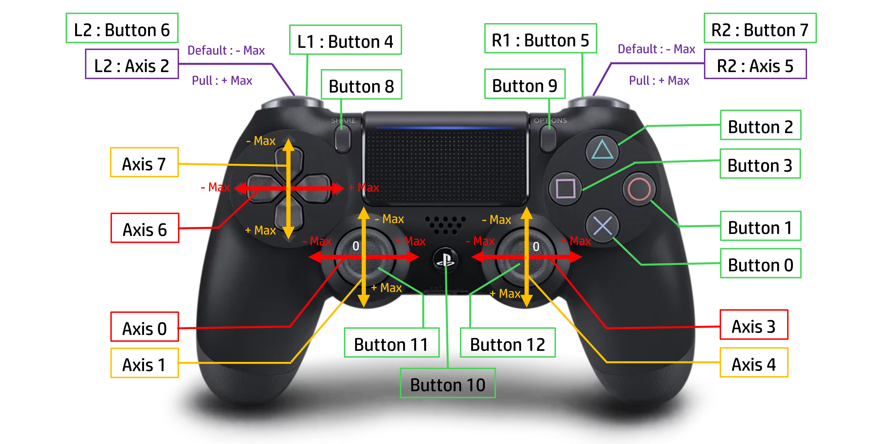

# Joystick_CH

This repository provides a C++ library for reading and processing joystick input on Linux (`/dev/input/js*`). It supports:

- Low-pass filtering  
- Dead-zone handling  
- Normalization to [–1, +1]  
- Quadratic “ramp-up” scaling  
- Optional slew-rate limiting  
- Accumulative button counters  
- **Initialization gating** (time + button)  
- A hard real-time 1 kHz loop  



## Features

- **State Processing**  
  A dedicated thread runs `joy::readJoystickEvents(running)` to:
  1. Open the joystick device (`JOYSTICK_DEVICE`) in non-blocking mode  
  2. Read `js_event` messages for axes and buttons  
  3. Update `joy::head_shared.axes[]` (double in [–1,1]) and `joy::head_shared.buttons[]` (0/1)  

- **Low-Pass Filter & Dead-Zone**  
  - `joy::lowpassFilter_Joy(prev, cur, DEFAULT_ALPHA)` smooths out noise.  
  - Inputs within `±DEFAULT_DEADZONE` map to zero to ignore small jitters.

- **Quadratic Scaling & Optional Slew-Rate**  
  - `joy::scaleJoystickOutput(x, DEFAULT_DEADZONE)` applies an x² curve for smooth ramp-up.  
  - Define `SLEW` to also apply `joy::applySlewRate(...)`, which clamps each step’s change to **SLEW_INITIAL_MAX_DELTA** (first second) or **SLEW_RUNNING_MAX_DELTA** thereafter.

- **Accumulative Button Counters**  
  - `joy::lr1_accumulated` is decreased by **ACCUM_STEP** when L1 (button 4) is pressed and increased by **ACCUM_STEP** when R1 (button 5) is pressed.  
  - `joy::lr2_accumulated` likewise for L2 (6) / R2 (7).  
  - Values are clamped to [–1, +1].

- **Initialization Gating (Time + Button)**  
  - The library will ignore **axis** updates until:
    1. **INIT_DELAY_SEC** seconds have elapsed since `readJoystickEvents` started, **and**  
    2. The **START** button (`BUTTON_START`) is pressed.  
  - During this “init delay” only the START button state is visible; all other inputs are held at zero.  
  - Tweak `INIT_DELAY_SEC` (in `joystick.h`) to set the delay, or set it to `0.0` to require only the START-button press.

- **Hard Real-Time 1 kHz Loop**  
  Each iteration measures its own duration and sleeps the remainder of **JOYSTICK_LOOP_US** (1 ms) via `usleep()`, ensuring a consistent 1 kHz update rate.

## File Structure
```plaintext
.
├── demo/
│   └── main.cpp           # Demo: spawns readJoystickEvents thread and prints state
├── images/
│   └── joystickAxisNum.png
├── joystick.h             # Public API, tunable constants & init gating flags
└── joystick.cpp           # Internal helpers & event-loop implementation
```

### joystick.h

- **Tunable constants**  
  - `JOYSTICK_DEVICE`, `JOYSTICK_LOOP_US`, `DEFAULT_ALPHA`, `DEFAULT_DEADZONE`  
  - `SLEW_INITIAL_MAX_DELTA`, `SLEW_RUNNING_MAX_DELTA`, `SLEW_SWITCH_TIME_S`  
  - `BUTTON_L1…R2`, `ACCUM_STEP`, `RAW_AXIS_MAX_NEG/POS`  
  - **`INIT_DELAY_SEC`**, **`BUTTON_START`** (init gating)  
- **Initialization flag**  
  - `extern std::atomic<bool> inputEnabled;`  
- **Public types & globals**  
  - `struct JoystickState { double axes[MAX_AXES]; int buttons[MAX_BUTTONS]; }`  
  - `extern JoystickState head_shared;`  
  - `extern double lr1_accumulated, lr2_accumulated;`  
- **Public API**  
  - `void readJoystickEvents(bool &running);`

### joystick.cpp

- Implements all helper functions inside an anonymous namespace:  
  `lowpassFilter_Joy`, `normalizeAxisValue`, `scaleJoystickOutput`, `applySlewRate`, `updateSharedState`, `updateAccumulators`  
- Defines `joy::readJoystickEvents(...)`, including the **5-second + START-button gating** via `inputEnabled`.

### demo/main.cpp

- Spawns a `std::thread` running `joy::readJoystickEvents(running)`  
- In the main thread, prints `joy::head_shared` and `joy::lr?_accumulated` every 10 ms

## Building & Running

**Prerequisites**  
- Linux with `/dev/input/js*` joystick support  
- A C++17 compiler (e.g. `g++`)  
- POSIX Threads

```bash
cd demo

# Build (SLEW optional via -DSLEW)
g++ -std=c++17 -I.. main.cpp ../joystick.cpp -o joystick_test -pthread

# Run
./joystick_test