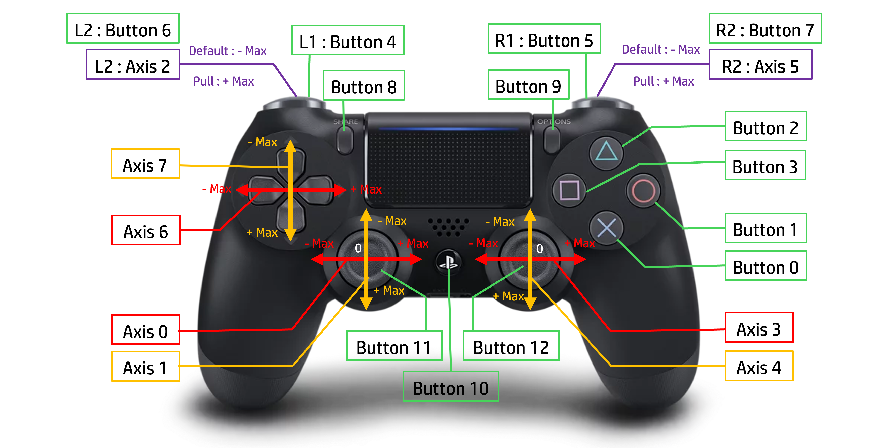

# Joystick_CH

리눅스 시스템(`/dev/input/js*`)에서 조이스틱 입력을 읽고 정밀하게 가공하여 제공하는 C++ 라이브러리입니다. 로봇 제어와 같은 실시간성 및 안전성이 중요한 시스템에 최적화되어 있습니다.



## 주요 기능

### 1. 스레드 분리 및 상태 관리 (State Processing)
- 전용 백그라운드 스레드에서 `joy::runJoystickThread`가 동작하여 메인 제어 루프의 성능에 영향을 주지 않고 실시간으로 입력을 처리합니다.
- 조이스틱 장치를 논블록킹(Non-blocking) 모드로 열어 이벤트가 없을 때도 시스템 자원을 효율적으로 사용합니다.

### 2. Hz 독립적 설계 (Time-based Logic)
- 루프 주기($dt$)를 실시간으로 측정하여 필터와 누적기에 반영합니다.
- 조이스틱 읽기 주파수(Hz)를 변경하거나 시스템 부하로 인해 루프 주기가 일시적으로 늘어나도, **로봇이 느끼는 조작감(필터 속도, 버튼 누적 속도)은 항상 일정**하게 유지됩니다.

### 3. 정밀한 신호 가공 (Signal Processing)
- **저역 통과 필터(LPF)**: 사용자가 설정한 시정수($\tau$)를 바탕으로 손떨림이나 센서 노이즈를 부드럽게 제거합니다.
- **데드존(Dead-zone)**: 스틱의 미세한 유격이나 쏠림 현상을 방지하기 위해 일정 범위 이하의 입력은 무시합니다.
- **2차 곡선 스케일링(Quadratic Scaling)**: 입력값에 $x^2$ 곡선을 적용하여, 중앙 부근에서는 정밀하게 조종하고 끝부분에서는 빠르게 기동할 수 있는 부드러운 가속감을 제공합니다.
- **슬루율 제한(Slew-rate)**: 입력값의 급격한 변화를 초당 변화율로 제한하여, 사용자의 거친 조작으로부터 로봇의 기구부와 모터를 보호합니다.

### 4. 하드웨어 안전 장치 (Safety Features)
- **초기화 게이팅(Initialization Gating)**: 프로그램 시작 후 의도치 않은 조작을 막기 위해, 설정된 시간이 지나고 **START** 버튼을 눌러야만 실제 제어 값이 출력됩니다.
- **비상 정지(Kill Switch)**: 특정 버튼(SHARE/SELECT)을 누르는 즉시 모든 제어 신호를 0으로 만들고 대기 상태로 전환합니다.
- **연결 끊김 방어**: 주행 중 조이스틱 연결이 해제되면 즉시 모든 입력을 0으로 초기화하고 로봇을 안전하게 정지시킨 후, 자동으로 재연결을 시도합니다.

### 5. 버튼 누적 카운터 (Accumulative Counters)
- L1/R1 및 L2/R2 버튼을 가상 축으로 활용할 수 있습니다. 버튼을 누르고 있는 시간에 비례하여 값이 [-1, 1] 범위 내에서 일정하게 증감합니다.

### 6. 스레드 안전성 (Mutex Protection)
- `std::mutex`와 `std::lock_guard`를 사용하여 데이터 쓰기/읽기 시 발생할 수 있는 **데이터 찢어짐(Tearing)이나 Race Condition을 완벽히 방지**합니다.
- 사용자는 `joy::getJoystickState()` 호출만으로 가장 최신의 조이스틱 상태 복사본을 안전하게 가져올 수 있습니다.

## 파일 구조

```plaintext
.
├── demo/
│   ├── main.cpp           # 데모: runJoystickThread를 생성하고 상태 출력
│   └── Makefile           # 데모 빌드용 메이크파일
├── images/
│   └── joystickAxisNum.png
├── joystick.h             # 공개 API, 사용자 설정(Hz, 필터 등) 영역
└── joystick.cpp           # 이벤트 루프 및 필터링 로직 구현부
```

## 사용 방법

### 1. 설정 (joystick.h)

`joystick.h` 상단의 **User Configuration Area**에서 장치 경로, 루프 주파수, 필터 시정수 등을 자유롭게 수정할 수 있습니다.

```cpp
#define CONFIG_JOYSTICK_HZ           1000    // 루프 주파수 (1000Hz = 1ms 주기)
#define CONFIG_FILTER_TAU            0.66f   // 필터 시정수 (값이 클수록 부드럽고 묵직함)
#define CONFIG_BUTTON_KILL           8       // 비상 정지 버튼 인덱스
```

### 2. 백그라운드 스레드 실행

메인 프로그램에서 조이스틱 전용 스레드를 생성하여 `joy::runJoystickThread`를 실행합니다.

```cpp
bool running = true;
std::thread joystickThread(joy::runJoystickThread, std::ref(running));
```

### 3. 데이터 읽기

제어 루프 내에서 `joy::getJoystickState()`를 호출하여 스레드 안전한 복사본을 가져와 사용합니다.

```cpp
joy::JoystickState state = joy::getJoystickState();
float v_ref = state.axes[1];
float spin_ref = state.axes[3];
```

## 데모 빌드 및 실행

제공된 `Makefile`을 사용하여 간편하게 데모를 빌드할 수 있습니다.

```bash
cd demo

# 빌드
make

# 실행
./joystick_test
```

## 시스템 요구사항

- Linux OS (`/dev/input/js*` 지원)
- C++17 이상 컴파일러 (g++)
- POSIX Threads (pthread)
